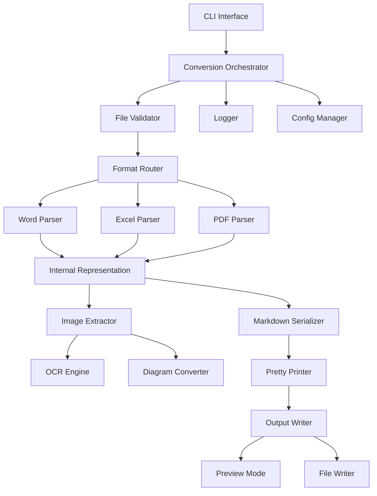

# Design Document: Document to Markdown Converter

## Overview

Document to Markdown Converterは、Word (.docx)、Excel (.xlsx)、PDF (.pdf) ファイルを高品質なMarkdown形式に変換するCLIツールです。モジュラーアーキテクチャを採用し、各ファイル形式に対応した専用パーサー、共通の内部表現、そしてMarkdownシリアライザーで構成されます。

### 設計の主要原則

1. **モジュラー設計**: 各ファイル形式のパーサーを独立したモジュールとして実装
2. **共通内部表現**: すべてのドキュメント形式を統一的な中間表現に変換
3. **拡張性**: 新しいファイル形式やMarkdown方言への対応が容易
4. **段階的実装**: CLIから開始し、将来的にGUI追加が可能な設計

## Architecture



### アーキテクチャの説明

- **CLI Interface**: コマンドライン引数を解析し、変換プロセスを開始
- **Conversion Orchestrator**: 変換プロセス全体を調整
- **File Validator**: 入力ファイルの形式と整合性を検証
- **Format Router**: ファイル拡張子に基づいて適切なパーサーを選択
- **Parsers (Word/Excel/PDF)**: 各形式専用のパーサー
- **Internal Representation**: 統一的な文書構造表現
- **Image Extractor**: 画像の抽出と保存
- **OCR Engine**: 画像内テキストの認識
- **Markdown Serializer**: 内部表現をMarkdownに変換
- **Pretty Printer**: Markdownの整形
- **Logger**: 変換プロセスのログ記録
- **Config Manager**: 設定ファイルの読み込みと管理

## Components and Interfaces

### 1. CLI Interface

```python
class CLIInterface:
    def parse_arguments(args: List[str]) -> ConversionConfig
    def display_help() -> None
    def display_version() -> None
```

**責務**: コマンドライン引数の解析、ヘルプ表示、バージョン情報表示

**主要オプション**:
- `--input, -i`: 入力ファイルパス（必須）
- `--output, -o`: 出力ファイルパス（省略時は標準出力）
- `--config, -c`: 設定ファイルパス
- `--preview, -p`: プレビューモード
- `--dry-run`: Dry-runモード
- `--log-level`: ログレベル（DEBUG, INFO, WARNING, ERROR）
- `--ocr-lang`: OCR言語設定
- `--extract-images`: 画像抽出の有効化
- `--diagram-to-mermaid`: 図のMermaid変換有効化

### 2. Conversion Orchestrator

```python
class ConversionOrchestrator:
    def __init__(config: ConversionConfig, logger: Logger)
    def convert(input_path: str) -> ConversionResult
    def batch_convert(input_paths: List[str]) -> List[ConversionResult]
```

**責務**: 変換プロセス全体の調整、エラーハンドリング、進捗管理

### 3. File Validator

```python
class FileValidator:
    def validate_file(file_path: str) -> ValidationResult
    def check_file_exists(file_path: str) -> bool
    def check_file_format(file_path: str) -> FileFormat
    def check_file_size(file_path: str, max_size: int) -> bool
    def check_file_readable(file_path: str) -> bool
```

**責務**: ファイルの存在確認、形式検証、サイズチェック、読み取り可能性確認

### 4. Format Router

```python
class FormatRouter:
    def get_parser(file_format: FileFormat) -> DocumentParser
```

**責務**: ファイル形式に応じた適切なパーサーの選択と返却

### 5. Document Parsers

#### Word Parser

```python
class WordParser(DocumentParser):
    def parse(file_path: str) -> InternalDocument
    def extract_headings(doc) -> List[Heading]
    def extract_paragraphs(doc) -> List[Paragraph]
    def extract_tables(doc) -> List[Table]
    def extract_lists(doc) -> List[List]
    def extract_images(doc) -> List[Image]
    def extract_links(doc) -> List[Link]
```

**使用ライブラリ**: python-docx

#### Excel Parser

```python
class ExcelParser(DocumentParser):
    def parse(file_path: str) -> InternalDocument
    def extract_sheets(workbook) -> List[Sheet]
    def extract_table_data(sheet) -> Table
    def handle_formulas(cell) -> str
```

**使用ライブラリ**: openpyxl

#### PDF Parser

```python
class PDFParser(DocumentParser):
    def parse(file_path: str) -> InternalDocument
    def extract_text(pdf) -> str
    def detect_structure(text: str) -> DocumentStructure
    def extract_tables(pdf) -> List[Table]
    def extract_images(pdf) -> List[Image]
    def is_scanned_pdf(pdf) -> bool
```

**使用ライブラリ**: PyPDF2, pdfplumber

### 6. Internal Representation

```python
class InternalDocument:
    metadata: DocumentMetadata
    sections: List[Section]
    images: List[ImageReference]
    
class Section:
    heading: Optional[Heading]
    content: List[ContentBlock]
    
class ContentBlock:
    # Union type: Paragraph, Table, List, Image, Code
    pass
    
class Heading:
    level: int  # 1-6
    text: str
    
class Paragraph:
    text: str
    formatting: TextFormatting
    
class Table:
    headers: List[str]
    rows: List[List[str]]
    
class List:
    ordered: bool
    items: List[ListItem]
    
class ImageReference:
    source_path: str
    extracted_path: Optional[str]
    alt_text: Optional[str]
    ocr_text: Optional[str]
```

**責務**: すべてのドキュメント形式を統一的に表現する中間データ構造

### 7. Image Extractor

```python
class ImageExtractor:
    def __init__(ocr_engine: OCREngine, diagram_converter: DiagramConverter)
    def extract_images(document: InternalDocument, output_dir: str) -> List[ImageReference]
    def save_image(image: Image, output_path: str) -> str
    def apply_ocr(image: Image, language: str) -> str
```

**責務**: 画像の抽出、保存、OCR処理の調整

### 8. OCR Engine

```python
class OCREngine:
    def __init__(language: str = "eng+jpn")
    def extract_text(image_path: str) -> str
    def extract_text_from_bytes(image_bytes: bytes) -> str
    def set_language(language: str) -> None
```

**使用ライブラリ**: pytesseract (Tesseract OCR)

**責務**: 画像からのテキスト抽出、多言語対応

### 9. Diagram Converter

```python
class DiagramConverter:
    def can_convert(image: Image) -> bool
    def convert_to_mermaid(image: Image) -> Optional[str]
```

**責務**: シンプルな図のMermaid構文への変換（初期実装では限定的）

### 10. Markdown Serializer

```python
class MarkdownSerializer:
    def __init__(config: SerializerConfig)
    def serialize(document: InternalDocument) -> str
    def serialize_heading(heading: Heading) -> str
    def serialize_paragraph(paragraph: Paragraph) -> str
    def serialize_table(table: Table) -> str
    def serialize_list(list: List) -> str
    def serialize_image(image: ImageReference) -> str
```

**責務**: 内部表現をMarkdown構文に変換

### 11. Pretty Printer

```python
class PrettyPrinter:
    def format(markdown: str) -> str
    def normalize_whitespace(markdown: str) -> str
    def align_tables(markdown: str) -> str
    def ensure_blank_lines(markdown: str) -> str
```

**責務**: Markdownの整形、可読性向上

### 12. Config Manager

```python
class ConfigManager:
    def load_config(config_path: str) -> ConversionConfig
    def save_config(config: ConversionConfig, config_path: str) -> None
    def merge_configs(file_config: ConversionConfig, cli_config: ConversionConfig) -> ConversionConfig
```

**設定ファイル形式**: YAML

**責務**: 設定ファイルの読み込み、保存、CLIオプションとのマージ

### 13. Logger

```python
class Logger:
    def __init__(log_level: LogLevel, output_path: Optional[str])
    def debug(message: str) -> None
    def info(message: str) -> None
    def warning(message: str) -> None
    def error(message: str, exception: Optional[Exception]) -> None
    def log_conversion_start(file_path: str, file_size: int) -> None
    def log_conversion_complete(output_path: str, duration: float) -> None
```

**責務**: 変換プロセスのログ記録、エラー追跡

### 14. Output Writer

```python
class OutputWriter:
    def write_to_file(content: str, output_path: str) -> None
    def write_to_stdout(content: str) -> None
    def preview(content: str, lines: int = 50) -> None
```

**責務**: 変換結果の出力（ファイル、標準出力、プレビュー）

## Data Models

### ConversionConfig

```python
@dataclass
class ConversionConfig:
    input_path: str
    output_path: Optional[str]
    config_file: Optional[str]
    
    # Output options
    heading_offset: int = 0
    table_style: TableStyle = TableStyle.STANDARD
    include_metadata: bool = False
    output_encoding: str = "utf-8"
    
    # Image options
    extract_images: bool = True
    image_format: ImageFormat = ImageFormat.PRESERVE
    embed_images_base64: bool = False
    diagram_to_mermaid: bool = False
    
    # OCR options
    enable_ocr: bool = True
    ocr_language: str = "eng+jpn"
    
    # Mode options
    preview_mode: bool = False
    dry_run: bool = False
    validate_output: bool = True
    
    # Logging options
    log_level: LogLevel = LogLevel.INFO
    log_file: Optional[str] = None
    
    # Performance options
    max_file_size_mb: int = 100
    batch_mode: bool = False
```

### ConversionResult

```python
@dataclass
class ConversionResult:
    success: bool
    input_path: str
    output_path: Optional[str]
    markdown_content: Optional[str]
    duration: float
    errors: List[str]
    warnings: List[str]
    stats: ConversionStats
```

### ConversionStats

```python
@dataclass
class ConversionStats:
    total_pages: int
    total_images: int
    images_extracted: int
    ocr_applied: int
    tables_converted: int
    headings_detected: int
```

## Correctness Properties

*A property is a characteristic or behavior that should hold true across all valid executions of a system-essentially, a formal statement about what the system should do. Properties serve as the bridge between human-readable specifications and machine-verifiable correctness guarantees.*


### Word Document Conversion Properties

Property 1: Text content extraction
*For any* valid .docx file with text content, the converter should produce Markdown output containing all the text from the source document
**Validates: Requirements 1.1**

Property 2: Heading level mapping
*For any* Word document with headings at various levels (H1-H6), the converter should map them to corresponding Markdown heading syntax (# for H1, ## for H2, etc.)
**Validates: Requirements 1.2**

Property 3: List structure preservation
*For any* Word document containing ordered or unordered lists, the converter should preserve the list structure using appropriate Markdown list syntax
**Validates: Requirements 1.3**

Property 4: Table conversion
*For any* Word document containing tables, the converter should convert them to valid Markdown table format with proper column alignment
**Validates: Requirements 1.4, 5.5**

Property 5: Text formatting preservation
*For any* Word document with bold or italic text, the converter should preserve the formatting using Markdown syntax (**bold**, *italic*)
**Validates: Requirements 1.5**

Property 6: Image extraction and referencing
*For any* Word document containing images, the converter should extract the images and include proper Markdown image references in the output
**Validates: Requirements 1.6**

Property 7: Hyperlink preservation
*For any* Word document containing hyperlinks, the converter should preserve them using Markdown link syntax [text](url)
**Validates: Requirements 1.7**

### Excel Document Conversion Properties

Property 8: Sheet extraction
*For any* valid .xlsx file, the converter should extract and convert all sheets to Markdown format
**Validates: Requirements 2.1**

Property 9: Multi-sheet handling
*For any* Excel file with multiple sheets, the converter should convert each sheet separately with clear sheet name headers
**Validates: Requirements 2.2**

Property 10: Data table conversion
*For any* Excel sheet containing data, the converter should convert it to valid Markdown table format
**Validates: Requirements 2.3**

Property 11: Formula value conversion
*For any* Excel cell containing a formula, the converter should output the calculated value in the Markdown table
**Validates: Requirements 2.4**

### PDF Document Conversion Properties

Property 12: PDF text extraction
*For any* valid PDF file with text content, the converter should extract all text and convert it to Markdown format
**Validates: Requirements 3.1**

Property 13: PDF heading detection
*For any* PDF containing structured headings, the converter should attempt to identify and convert them to appropriate Markdown heading levels
**Validates: Requirements 3.2**

Property 14: PDF table preservation
*For any* PDF containing tables, the converter should attempt to preserve the table structure in Markdown format
**Validates: Requirements 3.3**

Property 15: OCR on PDF images
*For any* PDF containing images with text, the converter should extract text using OCR capabilities
**Validates: Requirements 3.4**

Property 16: Scanned PDF OCR
*For any* scanned or image-based PDF, the converter should use OCR to extract text content
**Validates: Requirements 3.5**

Property 17: Multi-language OCR support
*For any* document in a supported language, the converter should successfully apply OCR with the specified language setting
**Validates: Requirements 3.7**

### Error Handling Properties

Property 18: Invalid format error handling
*For any* file with an invalid format (not .docx, .xlsx, or .pdf), the converter should return a descriptive error message indicating the expected formats
**Validates: Requirements 4.1**

Property 19: Corrupted file error handling
*For any* corrupted file that cannot be read, the converter should return an error message indicating the file cannot be read
**Validates: Requirements 4.2**

Property 20: File size limit enforcement
*For any* file exceeding the configured size limit, the converter should return an error message indicating the maximum supported file size
**Validates: Requirements 4.4**

Property 21: Graceful degradation
*For any* conversion that encounters an error, the converter should provide partial output with error details when possible
**Validates: Requirements 4.5**

### Output Quality Properties

Property 22: Structure preservation
*For any* source document with logical structure (sections, headings, paragraphs), the converter should preserve that structure in the Markdown output
**Validates: Requirements 5.1**

Property 23: Spacing and readability
*For any* converted document, the converter should maintain proper spacing and line breaks according to Markdown conventions
**Validates: Requirements 5.2**

Property 24: Special character handling
*For any* document containing special characters or symbols, the converter should properly escape them for Markdown compatibility and preserve them correctly in the output
**Validates: Requirements 5.3, 9.3**

Property 25: Valid Markdown generation
*For any* converted document, the output should be valid Markdown syntax that can be successfully parsed by standard Markdown processors
**Validates: Requirements 5.4**

### Interface and Usability Properties

Property 26: Output destination
*For any* conversion operation, the converter should output the Markdown content to either stdout or the specified file path as configured
**Validates: Requirements 6.2**

Property 27: Batch conversion
*For any* set of multiple input files, the converter should successfully convert all files in a single batch operation
**Validates: Requirements 6.5**

### Image Handling Properties

Property 28: Image directory creation
*For any* document containing images, the converter should extract and save them to a dedicated images directory following the naming convention {filename}/images/
**Validates: Requirements 7.1, 7.2**

Property 29: Image naming convention
*For any* extracted images, the converter should use either sequential naming (image_001.png, etc.) or preserve original filenames where available
**Validates: Requirements 7.3**

Property 30: Relative path references
*For any* extracted image, the Markdown output should reference it using a relative path pointing to the images directory
**Validates: Requirements 7.4**

Property 31: Image format support
*For any* common image format (PNG, JPEG, GIF, SVG), the converter should successfully extract and save the image
**Validates: Requirements 7.6**

Property 32: Image extraction failure handling
*For any* image that cannot be extracted, the converter should include a placeholder comment in the Markdown output
**Validates: Requirements 7.7**

Property 33: OCR on images with text
*For any* image containing text content, the converter should apply OCR and include the extracted text as alt text or caption
**Validates: Requirements 7.8**

Property 34: OCR text marking
*For any* OCR extraction performed, the converter should indicate OCR-extracted text with appropriate markers in the output
**Validates: Requirements 7.11**

### Configuration and Customization Properties

Property 35: Heading level offset
*For any* document with headings, when a heading offset is configured, the converter should apply the offset to all heading levels in the output
**Validates: Requirements 8.1**

Property 36: Metadata inclusion control
*For any* document, the converter should include or exclude metadata in the output based on the configuration setting
**Validates: Requirements 8.3**

Property 37: Image handling mode
*For any* document with images, the converter should either extract images to files or embed them as base64 based on the configuration setting
**Validates: Requirements 8.4**

Property 38: UTF-8 encoding output
*For any* conversion operation, the converter should output Markdown files in UTF-8 encoding by default
**Validates: Requirements 8.5, 9.2**

Property 39: Configuration file support
*For any* valid configuration file provided, the converter should load and apply the specified options to the conversion process
**Validates: Requirements 8.6, 8.7**

### Character Encoding Properties

Property 40: Multi-encoding detection
*For any* source document with a specific character encoding, the converter should detect and handle the encoding correctly
**Validates: Requirements 9.1**

Property 41: Encoding issue logging
*For any* character encoding issue detected during conversion, the converter should log a warning with details
**Validates: Requirements 9.5**

### Logging Properties

Property 42: Log file generation
*For any* conversion operation, the converter should generate a log file recording the operation
**Validates: Requirements 10.1**

Property 43: Conversion start logging
*For any* conversion that starts, the converter should log the source file path, size, and format
**Validates: Requirements 10.2**

Property 44: Conversion completion logging
*For any* conversion that completes, the converter should log the output file path, conversion time, and status
**Validates: Requirements 10.3**

Property 45: Error and warning logging
*For any* error or warning that occurs during conversion, the converter should log detailed messages with context
**Validates: Requirements 10.4**

### Preview and Validation Properties

Property 46: Preview mode file handling
*For any* conversion in preview mode, the converter should display the converted Markdown without saving to a file
**Validates: Requirements 11.1**

Property 47: Preview line limit
*For any* preview request, the converter should show the first N lines of the converted output (where N is configurable)
**Validates: Requirements 11.2**

Property 48: Validation error reporting
*For any* validation performed on Markdown output, the converter should report any syntax errors or warnings found
**Validates: Requirements 11.4**

Property 49: Dry-run mode
*For any* conversion in dry-run mode, the converter should perform the conversion without writing any output files
**Validates: Requirements 11.5**

### Parser and Serializer Properties

Property 50: Document parsing
*For any* source document, the converter should successfully parse it into an internal document structure
**Validates: Requirements 12.1**

Property 51: Markdown serialization
*For any* internal document structure, the converter should serialize it to valid Markdown format
**Validates: Requirements 12.2**

Property 52: Pretty printing consistency
*For any* Markdown output, the pretty printer should format it with consistent styling
**Validates: Requirements 12.3**

Property 53: Round-trip semantic equivalence
*For any* valid internal document structure, parsing a source document, serializing to Markdown, then parsing the Markdown should produce semantically equivalent content
**Validates: Requirements 12.4**

## Error Handling

### Error Categories

1. **Input Validation Errors**
   - Invalid file format
   - File not found
   - File not readable
   - File size exceeds limit
   - Corrupted file

2. **Parsing Errors**
   - Malformed document structure
   - Unsupported document features
   - Character encoding issues

3. **Conversion Errors**
   - Image extraction failure
   - OCR failure
   - Table parsing failure

4. **Output Errors**
   - Cannot write to output file
   - Disk space insufficient
   - Permission denied

### Error Handling Strategy

1. **Fail Fast for Critical Errors**: Invalid format, file not found, cannot write output
2. **Graceful Degradation for Partial Failures**: Image extraction failure, OCR failure
3. **Detailed Error Messages**: Include file path, error type, and suggested resolution
4. **Partial Output**: When possible, provide converted content up to the point of failure
5. **Error Logging**: All errors logged with full context for troubleshooting

### Error Response Format

```python
@dataclass
class ConversionError:
    error_type: ErrorType
    message: str
    file_path: str
    line_number: Optional[int]
    context: Optional[str]
    suggestion: Optional[str]
```

## Testing Strategy

### Dual Testing Approach

This project requires both unit testing and property-based testing for comprehensive coverage:

- **Unit tests**: Verify specific examples, edge cases, and error conditions
- **Property tests**: Verify universal properties across all inputs

Both approaches are complementary and necessary. Unit tests catch concrete bugs and validate specific scenarios, while property tests verify general correctness across a wide range of inputs.

### Property-Based Testing

**Framework**: Hypothesis (Python)

**Configuration**:
- Minimum 100 iterations per property test
- Each test tagged with: **Feature: document-to-markdown-converter, Property {number}: {property_text}**

**Test Data Generation**:
- Generate random Word documents with various structures
- Generate random Excel files with multiple sheets and data types
- Generate random PDFs with text, tables, and images
- Generate documents with special characters, various encodings
- Generate edge cases: empty files, very large files, corrupted files

**Property Test Examples**:

```python
from hypothesis import given, strategies as st

@given(st.text(min_size=1))
def test_property_1_text_extraction(text_content):
    """Feature: document-to-markdown-converter, Property 1: Text content extraction"""
    # Generate a .docx file with the text content
    docx_file = create_word_document(text_content)
    
    # Convert to Markdown
    result = converter.convert(docx_file)
    
    # Verify text is present in output
    assert text_content in result.markdown_content
```

### Unit Testing

**Framework**: pytest

**Test Categories**:

1. **Format-Specific Tests**
   - Word document conversion examples
   - Excel spreadsheet conversion examples
   - PDF conversion examples

2. **Edge Case Tests**
   - Empty files (Requirements 4.3)
   - Empty Excel sheets (Requirements 2.5)
   - Handwritten notes OCR (Requirements 3.6, 7.9)
   - Diagram to Mermaid conversion (Requirements 7.5)

3. **Integration Tests**
   - CLI interface (Requirements 6.1)
   - Configuration file loading (Requirements 8.6, 8.7)
   - Batch conversion (Requirements 6.5)
   - Preview mode (Requirements 11.1, 11.2)
   - Dry-run mode (Requirements 11.5)
   - Log level configuration (Requirements 10.5, 10.6)
   - Encoding options (Requirements 9.4)
   - Table style selection (Requirements 8.2)
   - OCR language specification (Requirements 7.10)
   - Validation mode (Requirements 11.3)
   - Progress indicator (Requirements 6.3)

4. **Error Handling Tests**
   - Invalid file format errors
   - Corrupted file errors
   - File size limit errors
   - Permission errors
   - Disk space errors

### Test Coverage Goals

- Line coverage: > 80%
- Branch coverage: > 75%
- All properties: 100% (each property must have a property test)
- All edge cases: 100% (each edge case must have a unit test)
- All error conditions: 100% (each error type must have a test)

### Testing Best Practices

1. **Avoid Too Many Unit Tests**: Property-based tests handle comprehensive input coverage
2. **Focus Unit Tests On**:
   - Specific examples demonstrating correct behavior
   - Integration points between components
   - Edge cases and error conditions
3. **Property Tests Should Focus On**:
   - Universal properties holding for all inputs
   - Comprehensive input coverage through randomization

## Implementation Notes

### Technology Stack

- **Language**: Python 3.9+
- **Word Processing**: python-docx
- **Excel Processing**: openpyxl
- **PDF Processing**: PyPDF2, pdfplumber
- **OCR**: pytesseract (Tesseract OCR)
- **CLI Framework**: Click or argparse
- **Configuration**: PyYAML
- **Testing**: pytest, Hypothesis
- **Markdown Parsing**: markdown-it-py (for validation)

### Development Phases

**Phase 1: Core Infrastructure (MVP)**
- CLI interface
- File validation
- Basic Word document conversion (text, headings, lists)
- Basic Markdown serialization
- Logging

**Phase 2: Extended Format Support**
- Excel conversion
- PDF text extraction
- Table conversion for all formats
- Image extraction (without OCR)

**Phase 3: Advanced Features**
- OCR integration
- Configuration file support
- Preview and dry-run modes
- Batch conversion

**Phase 4: Quality and Polish**
- Pretty printer enhancements
- Diagram to Mermaid conversion (limited)
- Performance optimization
- Comprehensive error handling

### Future Enhancements (Out of Scope for Initial Release)

- GUI interface
- Web service API
- Support for additional formats (RTF, ODT, etc.)
- Advanced diagram recognition and conversion
- Cloud storage integration
- Real-time conversion monitoring dashboard
